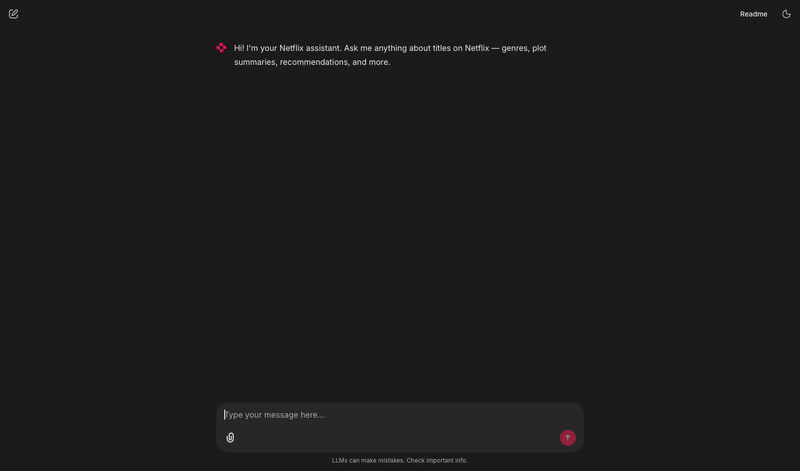

# LLMOps Final Project

Netflix recommendation RAG system with:
- OpenAI embeddings + GPT-4o generation
- Zilliz Cloud (Milvus) vector store with versioned collections
- Langfuse observability and user feedback tracking
- Chainlit chat UI + FastAPI serving layer
- Prefect ingestion DAG
- Deployed on GCP Cloud Run via GitHub Actions CI

*Chat UI showing a Netflix recommendation, active version tag, and thumbs up/down feedback*

## Docs

- [Architecture](docs/architecture.md)
- [Development history](docs/history.md)
