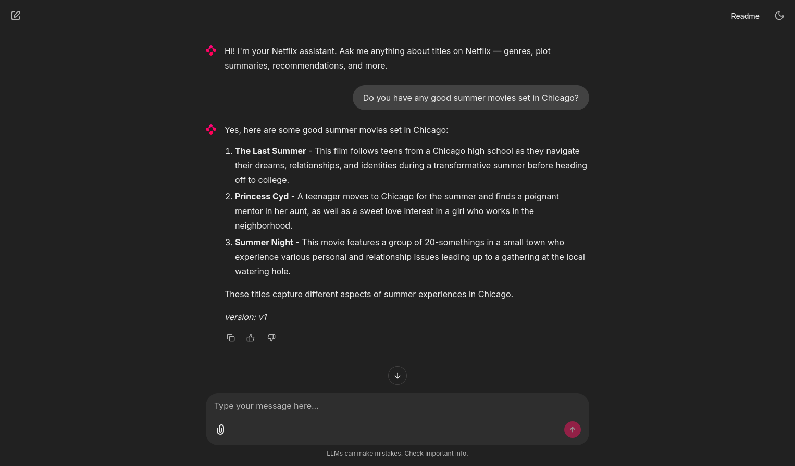
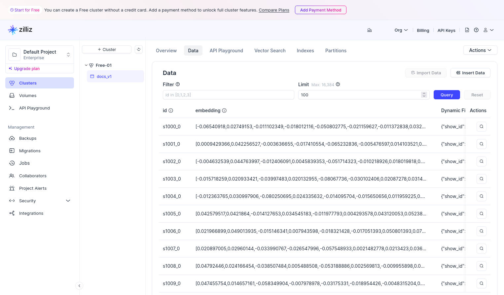
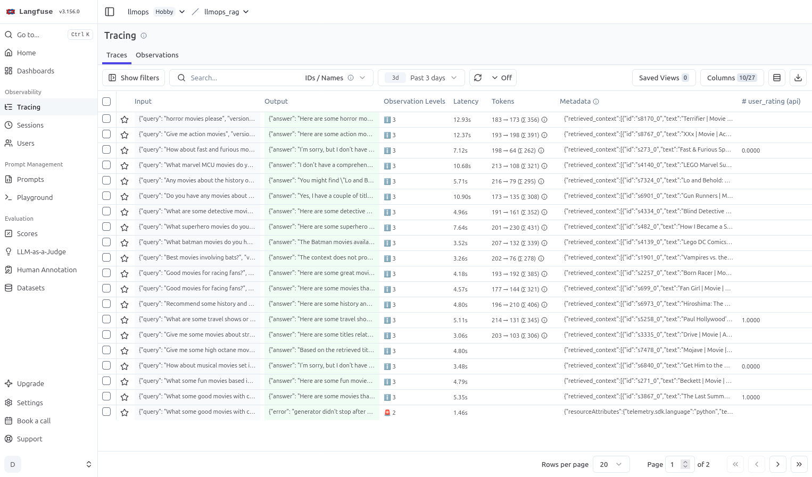
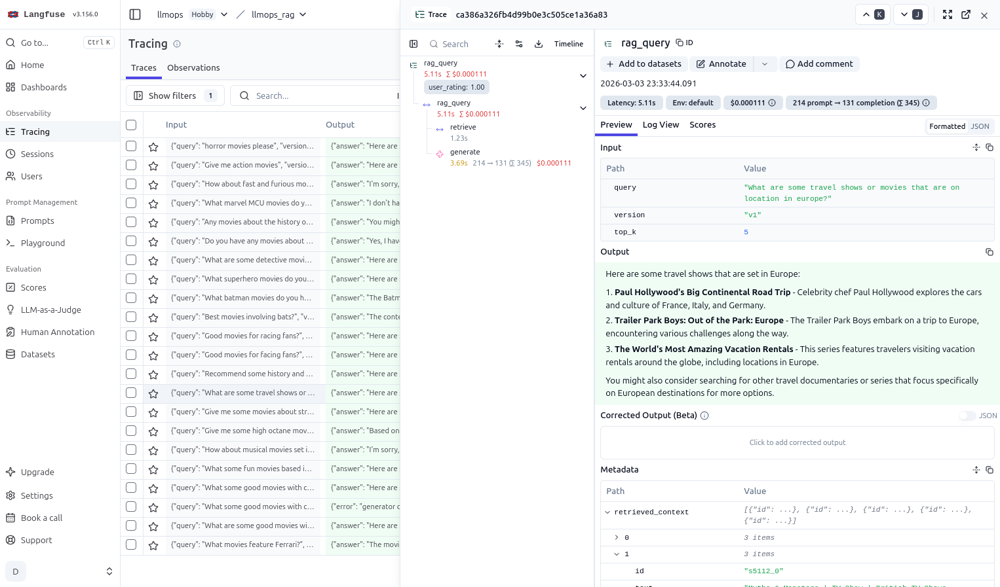
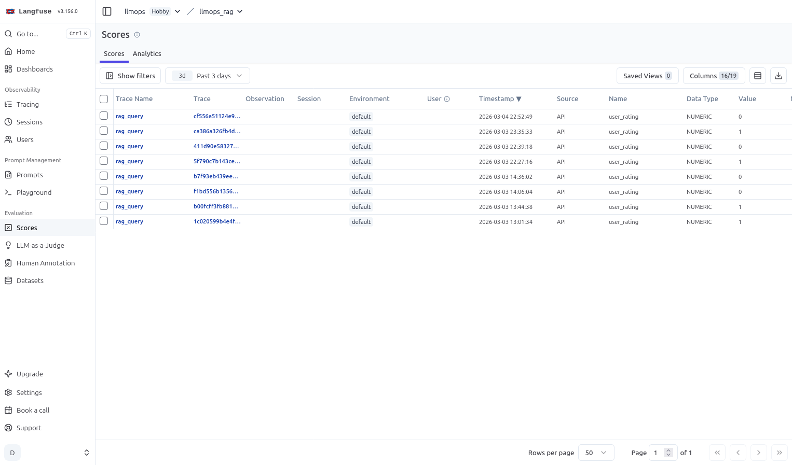
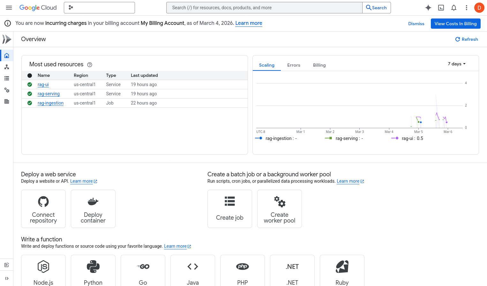
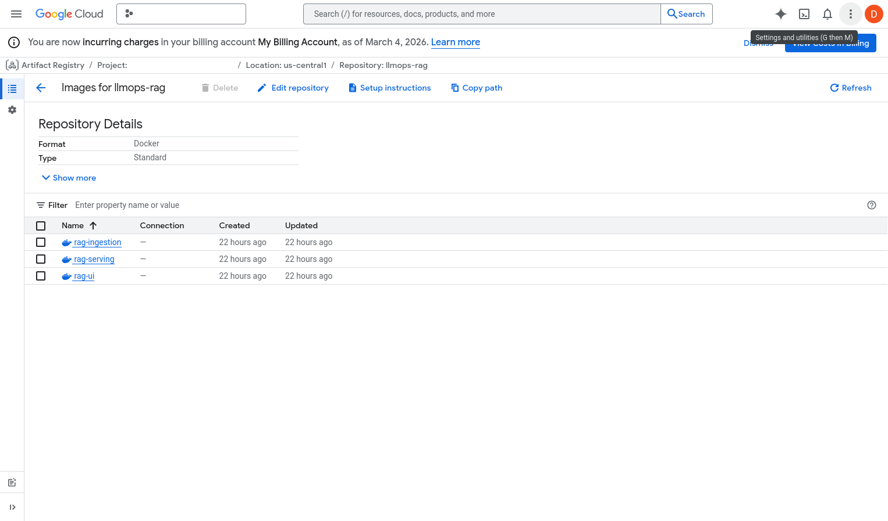

# RAG LLMOps Architecture

## Overview

This document describes the architecture for a production-ready Retrieval-Augmented Generation (RAG) system with LLMOps practices built in. The design prioritizes separation of concerns, flexibility to swap components via configuration, and a feedback loop that drives continuous improvement of retrieval quality.

The system is structured to be deployable by a single developer or a small team, with a folder layout that reflects how responsibilities would be divided across multiple people. This separation is intentional — it communicates architectural intent and makes the system easier to reason about as it grows.

---

## Core Design Principles

- **Ingestion and serving are separate pipelines** with different lifecycles, failure modes, and iteration rhythms
- **The vector store is a versioned artifact**, not a live database that gets overwritten — this enables A/B testing and safe rollback
- **Shared contracts** (schemas, interfaces, config) are the connective tissue between components — not direct imports across domains
- **Config-driven behavior** — no hardcoded paths, model names, or connection strings anywhere in application code
- **Stateless containers** — all persistent state lives in external managed services, enabling Cloud Run deployment

---

## Final Stack

| Component | Tool | Hosting |
|---|---|---|
| Embeddings | OpenAI API (`text-embedding-3-small`) | External API |
| LLM | OpenAI API (`gpt-4o-mini`) | External API |
| Vector Store | Zilliz Cloud (Milvus-compatible) | Free tier, permanent |
| Monitoring & Tracing | Langfuse Cloud | Hobby tier, free |
| UI | Chainlit | Cloud Run |
| Serving | FastAPI | Cloud Run |
| Ingestion | Prefect DAG | Cloud Run Job |
| CI | GitHub Actions | Free for public repos |
| Image Registry | GCP Artifact Registry | GCP |

---

## Architecture Decision: API Embeddings

The system uses OpenAI's embedding API rather than locally hosted HuggingFace models. This decision was made deliberately with the following tradeoffs understood:

**Why API embeddings:**
- No model weights to manage or share between containers
- Containers remain stateless, compatible with Cloud Run
- Still supports swapping between embedding models (e.g. `text-embedding-3-small` vs `text-embedding-3-large`) via config
- The A/B testing and versioning mechanics work identically

**What this forecloses:**
- Fine-tuning the embedding model (OpenAI does not expose this)
- Using arbitrary HuggingFace models without changing deployment target
- Zero per-request embedding cost

**Migration path if needed:**
Switching to local HuggingFace embeddings requires: (1) implementing a new `embedders.py` class behind the existing interface, (2) moving from Cloud Run to a VM or Kubernetes to support shared model weight volumes. No other application code changes.

---

## Two Pipelines

### Ingestion Pipeline (offline / batch)

Runs on demand or on a schedule. Produces a versioned vector store collection.

```
Raw documents
      │
      ▼
loaders.py        — load documents from source
      │
      ▼
chunkers.py       — split into chunks with overlap
      │
      ▼
embedders.py      — call OpenAI embeddings API
      │
      ▼
writers.py        — write chunks + vectors to Zilliz Cloud
      │
      ▼
version manifest  — record model, params, timestamp, doc count
```

Triggered via Prefect DAG. Runs as a Cloud Run Job in production.

### Serving Pipeline (real-time)

Always-on FastAPI service. Handles user queries end to end.

```
User query (via Chainlit UI)
      │
      ▼
/query endpoint   — FastAPI
      │
      ├── embed query via OpenAI API
      ├── retrieve top-k chunks from Zilliz (versioned collection)
      ├── assemble context + prompt via LangChain
      ├── call OpenAI LLM API
      └── log trace to Langfuse (query, retrieved docs, scores, response, version tag)
      │
      ▼
Return { answer, trace_id } to UI
```


*Chainlit showing a recommendation response tagged with the active vector store version — feedback buttons feed directly into Langfuse*

---

## Versioning Mechanic

Every ingestion run produces a new named collection in Zilliz Cloud. Collections follow the naming convention `docs_v1`, `docs_v2`, etc. The serving layer reads `active_version` from config to determine which collection to query. Changing the active version is a config change and container restart — old collections are never deleted until explicitly archived.

### Version Manifest

Each ingestion run appends to a `versions.json` file tracking what produced each version:

```json
{
  "version": "v1",
  "created_at": "2026-01-15T10:00:00Z",
  "embedding_model": "text-embedding-3-small",
  "chunk_size": 512,
  "chunk_overlap": 50,
  "doc_count": 8807,
  "notes": "baseline"
}
```


*The `docs_v1` collection live in Zilliz Cloud — each ingestion run writes a new named collection, old ones are never overwritten*

### A/B Testing

Traffic splitting between two versions is controlled via `serving.yaml`:

```yaml
vector_store:
  ab_test:
    enabled: true
    versions:
      - name: "v1"
        weight: 0.5
      - name: "v2"
        weight: 0.5
```

Each request is tagged in Langfuse with which version served it. Analysis compares recall and feedback scores across versions to determine a winner.

---

## Feedback Loop

Explicit user feedback flows through the system as follows:

1. User receives an answer from the UI along with a `trace_id`
2. User clicks thumbs up or down in Chainlit
3. UI fires `POST /feedback` with `{ trace_id, rating }`
4. FastAPI calls Langfuse to attach a score to the trace
5. Langfuse now holds the full trace and the human verdict linked by `trace_id`
6. Analysis queries Langfuse to compare feedback scores across vector store versions
7. Results drive the decision to re-run ingestion with new params or a different embedding model

The `trace_id` is the thread that connects every step. Every response gets one, every feedback event references one.


*Every `rag_query` is logged as a trace in Langfuse, capturing latency, retrieved context, and scores*


*A single trace expanded — the input query, LLM output, metadata, and the user rating attached via `trace_id`*


*User ratings (0 = thumbs down, 1 = thumbs up) stored as scores and linked to traces — the signal used to compare vector store versions*

---

## Abstract Vector Store Interface

All vector store interaction goes through an abstract base class. Neither ingestion nor serving imports a backend directly — they call the interface, and the config file determines which backend is instantiated.

```
shared/vector_store.py        — abstract base class (create_collection, write, query)
shared/backends/
    zilliz_store.py           — production backend (Milvus-compatible)
    chroma_store.py           — local dev backend (no cloud account needed)
```

Swapping backends is a config change:

```yaml
vector_store:
  backend: "zilliz"           # or "chroma" for local dev
```

The same interface abstraction applies to embedding models in `ingestion/embedders.py`.

---

## Project Structure

```
rag-project/
│
├── .github/
│   └── workflows/
│       └── ci.yml                  — test, build, push on merge to main
│
├── config/
│   ├── pipeline.yaml               — embedding model, chunking params, version tag
│   ├── serving.yaml                — active version, A/B test config, LLM settings
│   └── monitoring.yaml             — Langfuse project settings
│
├── ingestion/                      — batch pipeline domain
│   ├── dag.py                      — Prefect flow definition
│   ├── loaders.py                  — document loading
│   ├── chunkers.py                 — chunking strategies
│   └── embedders.py                — embedding model abstraction + OpenAI implementation
│
├── serving/                        — real-time API domain
│   ├── api.py                      — FastAPI app, /query /feedback /health endpoints
│   ├── retriever.py                — query → vector store lookup
│   ├── chain.py                    — LangChain chain assembly
│   └── versioning.py               — active version selection, A/B traffic splitting
│
├── monitoring/                     — observability domain
│   ├── instrumentation.py          — Langfuse trace/span wrappers
│   └── feedback.py                 — posts feedback scores to Langfuse
│
├── ui/                             — user-facing layer
│   └── app.py                      — Chainlit chat interface + feedback buttons
│
├── shared/                         — contracts between all domains
│   ├── config_loader.py            — reads yaml + env vars, single source of truth
│   ├── schemas.py                  — Pydantic models: Chunk, RetrievalResult
│   ├── vector_store.py             — abstract base class for vector store backends
│   └── backends/
│       ├── zilliz_store.py
│       └── chroma_store.py
│
├── dataraw/                        — raw source documents for ingestion
│
├── docker/
│   ├── Dockerfile.serving          — self-contained: python base + deps + serving/
│   ├── Dockerfile.ingestion        — self-contained: python base + deps + ingestion/
│   ├── Dockerfile.ui               — self-contained: python base + deps + ui/
│   └── docker-compose.yml          — local development only
│
├── tests/
│   └── unit/                       — pure Python logic tests (no ML deps)
│
├── docs/
│   ├── architecture.md             — this document
│   ├── history.md                  — development narrative: prototype → production
│   └── notebooks/
│       └── rag-prototype.ipynb     — original exploration notebook
│
├── versions.json                   — version manifest, updated by ingestion DAG
├── requirements.txt                — fully pinned Python dependencies
├── .env.example                    — template for required environment variables
└── README.md
```

---

## Configuration Structure

### config/pipeline.yaml

```yaml
pipeline:
  embedding_model: "text-embedding-3-small"
  chunk_size: 512
  chunk_overlap: 50
  vector_store_version: "v1"

vector_store:
  backend: "zilliz"
  collection_prefix: "docs"
  connection_uri: "${ZILLIZ_URI}"
  token: "${ZILLIZ_TOKEN}"
```

### config/serving.yaml

```yaml
llm:
  model: "gpt-4o-mini"
  temperature: 0.2

vector_store:
  active_version: "v1"
  collection_prefix: "docs"
  ab_test:
    enabled: false
    versions: []
```

### config/monitoring.yaml

```yaml
langfuse:
  host: "${LANGFUSE_HOST}"
  public_key: "${LANGFUSE_PUBLIC_KEY}"
  secret_key: "${LANGFUSE_SECRET_KEY}"
```

### .env.example

```bash
# Zilliz Cloud
ZILLIZ_URI=
ZILLIZ_TOKEN=

# OpenAI
OPENAI_API_KEY=

# Langfuse Cloud
LANGFUSE_PUBLIC_KEY=
LANGFUSE_SECRET_KEY=
LANGFUSE_HOST=https://cloud.langfuse.com

# App
VECTOR_STORE_BACKEND=zilliz
ACTIVE_VERSION=v1

# Deployment
GCP_PROJECT_ID=
REGISTRY=us-central1-docker.pkg.dev/${GCP_PROJECT_ID}/llmops-rag
```

---

## Docker and Local Development

### Local Dev (Docker Compose)

```yaml
services:
  serving:
    build:
      context: ..
      dockerfile: docker/Dockerfile.serving
    ports:
      - "8000:8000"
    env_file:
      - ../.env
    healthcheck:
      test: ["CMD", "python", "-c", "import urllib.request; urllib.request.urlopen('http://localhost:8000/health')"]
      interval: 30s
      timeout: 10s
      retries: 3

  ui:
    build:
      context: ..
      dockerfile: docker/Dockerfile.ui
    ports:
      - "8080:8080"
    environment:
      - SERVING_URL=http://serving:8000
    depends_on:
      - serving

  ingestion:
    build:
      context: ..
      dockerfile: docker/Dockerfile.ingestion
    env_file:
      - ../.env
    profiles:
      - ingestion
```

The ingestion service uses `profiles: [ingestion]` so it only runs when explicitly invoked:

```bash
docker compose up                                  # serving + ui only
docker compose --profile ingestion run ingestion   # run ingestion pipeline
```

### Dockerfile Pattern

Each service has a self-contained two-stage Dockerfile. No shared base image:

```
Stage 1 (base):   python:3.11.11-slim, pip install requirements.txt, copy shared/
Stage 2 (final):  FROM base, copy service-specific code, set entrypoint
```

This keeps each service image independently buildable. Platform targeting (`linux/amd64` for
Cloud Run) is applied at build time via `docker buildx build --platform linux/amd64`.

---

## Production Deployment (GCP Cloud Run)

Each service deploys as a separate Cloud Run service. Ingestion deploys as a Cloud Run Job.

```
Cloud Run service: rag-serving   — always on, auto-scales, scales to zero when idle
Cloud Run service: rag-ui        — always on, calls serving via HTTPS URL
Cloud Run Job:     rag-ingestion — triggered on demand, runs to completion, exits
```

All services are stateless. Persistent state lives in:
- Zilliz Cloud (vector collections)
- Langfuse Cloud (traces and feedback scores)

### CI Pipeline (GitHub Actions)

```
on push to main branch:
  1. Run pytest tests/unit/ (must pass before build starts)
  2. Build serving, ingestion, ui images for linux/amd64
  3. Tag with git commit SHA
  4. Push to GCP Artifact Registry
```

Deployment to Cloud Run is a manual step after CI succeeds — a human promotes the new image
using `make deploy-serving VERSION=<sha>`.


*All three services deployed: `rag-ui` and `rag-serving` as always-on Cloud Run services, `rag-ingestion` as a Cloud Run Job*


*The `llmops-rag` Artifact Registry repository holding all three service images, each tagged with the git commit SHA*

---

## Shared Schemas

All data passed between ingestion and serving goes through Pydantic models defined in `shared/schemas.py`. No ad-hoc dicts.

```python
class Chunk(BaseModel):
    id: str
    text: str
    vector: List[float]
    metadata: Dict[str, Any]    # source doc, page, version tag, chunk index

class RetrievalResult(BaseModel):
    chunk: Chunk
    score: float                # similarity score from vector store
```

---

## Key Dependency Rules

- `ingestion/` and `serving/` never import from each other
- All cross-domain data exchange goes through `shared/schemas.py`
- All vector store access goes through `shared/vector_store.py`
- All config access goes through `shared/config_loader.py`
- Secrets never appear in config yaml files — only env var references like `${ZILLIZ_URI}`
- Service containers communicate by service name, never `localhost`

---

## Future Extension Points

| Change | What moves | What stays the same |
|---|---|---|
| Switch to local HuggingFace embeddings | `embedders.py` implementation, deployment target (VM/K8s) | Everything else |
| Add Pinecone as vector store option | One new file in `shared/backends/`, one branch in factory | All ingestion and serving code |
| Move to self-hosted Langfuse | `LANGFUSE_HOST` env var | All instrumentation code |
| Migrate to Kubernetes | Deployment manifests | All application code and Dockerfiles |
| Add a new embedding model to A/B test | `pipeline.yaml` version bump, re-run ingestion DAG | Everything else |
| Fine-tune embedding model | Requires local HuggingFace path, see migration note above | Shared interface contracts |
